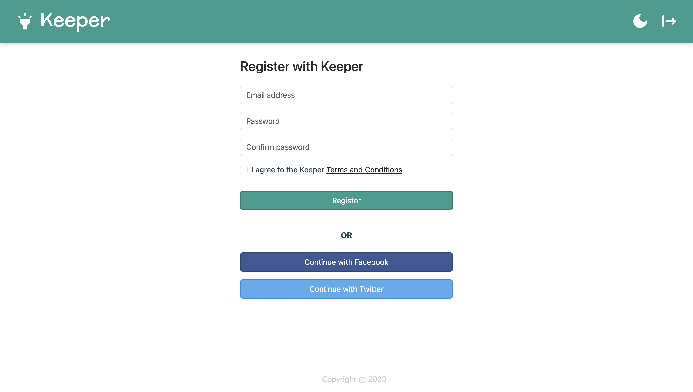

<h3> Note Keeper Web Application </h3>
<ul>
  <li> A simple clone of Google's 'Keep' note-keeping application </li>
  <li> Allows authenticated users to add, edit, and remove notes from their note collection</li>
  <li> Supports both local and third-party (Twitter, Facebook OAuth 2.0) authentication methods via passport.js (*see TODO.txt) </li>
<li> Users can toggle between two comprehensive UI themes (light and dark mode) </li>
  <li> User account credentials, and application data (their note collection) stored persistently in MongoDB cluster </li>
  <li> Frontend powered by React.js; backend powered by Node.js and express.js
    <li> Skeleton UI template credit: <a href="https://www.udemy.com/share/1013gG3@zBviuF2z50UA_envJx9fJx_lMecsLiq4q6zXlQkeRgUkzn9aI8yDnrWVLByo8FYQsQ==/" target="_blank">Dr. Angela Yu, Udemy Web Development Bootcamp</a> </li>
</ul>

<h3> Light Mode </h3>

<h3> Dark Mode </h3>

