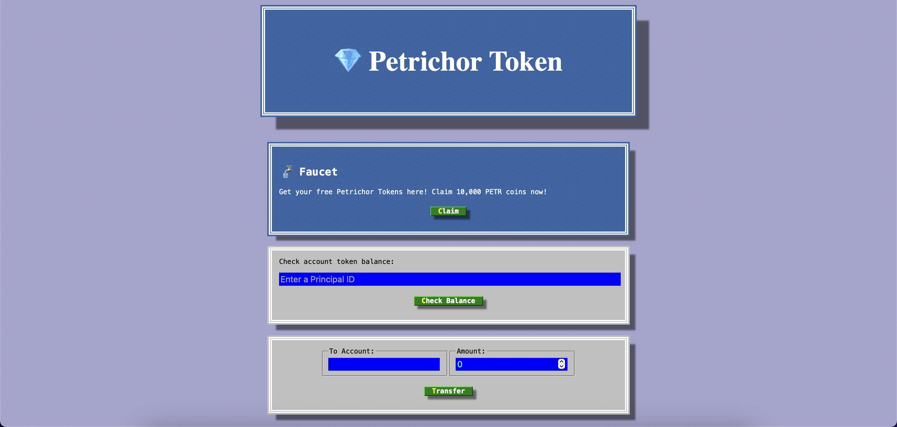

<h3> Petrichor [PETR] Crypto Token </h3>
<ul> 
  <li> A cryptocurrency token built on the Internet Computer blockchain </li>
  <li> Allows authenticated users to claim free tokens, check their current balance, or transfer tokens to another address </li>
  <li> Users are authenticated via Internet Identity (which takes advantage of built-in biometric authentication methods) </li>
  <li> User balances are stored securely, and indefinitely, across multiple canister update cycles </li>
  <li> Frontend dashboard (<i>./src/token_assets</i>) powered by React.js; backend smart contract (<i>./src/token</i>) implemented in Motoko </li>
    <li> Skeleton UI template credit: 
      <a href="https://www.udemy.com/share/1013gG3@zBviuF2z50UA_envJx9fJx_lMecsLiq4q6zXlQkeRgUkzn9aI8yDnrWVLByo8FYQsQ==/" target="_blank">Dr. Angela Yu, Udemy Web Development Bootcamp</a> 
    </li>
</ul>

