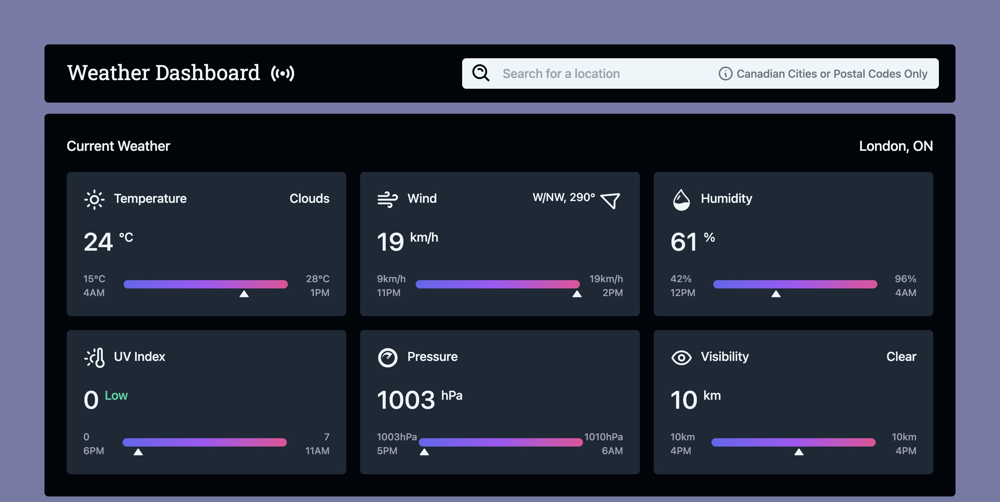
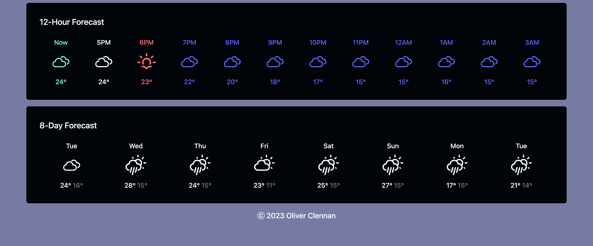

<h3> Weather Dashboard <a href="https://weather-dashboard.live"> [Live Demo] </a></h3>
<ul>
  <li> A modern weather dashboard displaying the current weather conditions, as well as hourly and daily forecasts </li>
  <li> Upon initial loading of the application, users will be asked to share access to their current position so it can be set as the default location </li>
  <li> Users are able to view weather data for alternative locations at any time by searching via city name or postal code 
    <ul>
      <li> Note: only Canadian locations are supported at this time </li>
    </ul>
  </li>
  <li> All weather data is provided by the OpenWeatherMap <a href="https://openweathermap.org/api/one-call-3"> One Call API 3.0 </a> service </li>
  <li> Frontend powered by React.js and styled with TailwindCSS </li>
</ul>

